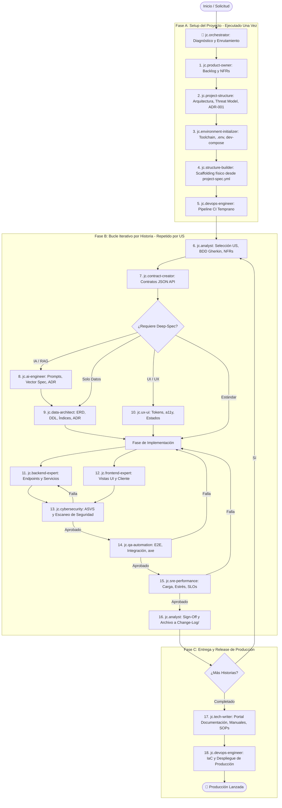

# 🚀 JC Multi-Agent SDLC Framework
### Framework Autónomo de Ingeniería de Software para Google Antigravity

[](LICENSE)
[](framework.json)
[](AGENTS.md)

El **JC Multi-Agent SDLC Framework** es un conjunto de **17 habilidades (skills) especializadas**, reglas maestras de gobernanza (`AGENTS.md`) y un orquestador determinista diseñado para automatizar y gobernar el ciclo completo de desarrollo de software (SDLC) en **Google Antigravity IDE**.

---

## 📦 Instalación Rápida

Puedes instalar el framework en cualquier proyecto nuevo o existente en segundos mediante **npx**, **npm** o **scripts nativos**:

### Opción 1: Con Node CLI (Recomendado — clona este repositorio)

Clona el repositorio y ejecuta directamente con Node:

```bash
git clone <url-del-repositorio>
cd jc-skills

# Asistente interactivo de instalación
node bin/cli.js init

# O usa flags directos:
node bin/cli.js init --local --all
```

#### Modos de instalación directa (Flags):
```bash
# 1. Instalar localmente en el proyecto actual (.agents/) con plantillas
node bin/cli.js init --local --all

# 2. Instalar globalmente en tu equipo (~/.gemini/config/skills)
# Disponible para CUALQUIER proyecto abierto en Antigravity automáticamente
node bin/cli.js init --global

# 3. Listar todas las skills disponibles y su fase SDLC
node bin/cli.js list

# 4. Verificar estado de la instalación
node bin/cli.js status
```

### Opción 2: Instalador en Bash (Linux / macOS / WSL) — Más simple

```bash
chmod +x ./install.sh
./install.sh --local --all
```

### Opción 3: Instalador en PowerShell (Windows)
```powershell
# Asistente interactivo
.\install.ps1

# Instalación Global (para todos los proyectos)
.\install.ps1 -Global

# Instalación Local con plantillas
.\install.ps1 -Local -All
```

---

## 🏛️ Arquitectura del Ciclo de Vida SDLC

El framework organiza las 17 habilidades en **3 fases secuenciales** gobernadas por el orquestador:



---

## 🗂️ Catálogo de las 17 Habilidades (Skills)

| # | Skill | Fase | Rol Principal |
|---|---|---|---|
| **0** | `jc.orchestrator` | **Gobernanza** | Conductor autónomo del pipeline, gestión de transiciones y resolución de bucles. |
| **1** | `jc.product-owner` | **Fase A** | Estratega de producto. Define épicas, historias de usuario iniciales y NFRs. |
| **2** | `jc.project-structure` | **Fase A** | Arquitecto de software. Define stack, ADR-001, RBAC y `project-spec.yml`. |
| **3** | `jc.environment-initializer` | **Fase A** | Bootstrapping de entorno, venvs, dependencias, `.env` y `docker-compose.dev.yml`. |
| **4** | `jc.structure-builder` | **Fase A** | Creación física de directorios y anclajes basada en `project-spec.yml`. |
| **5** | `jc.devops-engineer` | **Fase A / C** | CI/CD temprano, Dockerfiles multi-stage, Terraform/Helm y despliegues. |
| **6** | `jc.analyst` | **Fase B** | Analista de requisitos. Escenarios BDD Gherkin, NFRs y aprobación final (sign-off). |
| **7** | `jc.contract-creator` | **Fase B** | Especialista en contratos estandarizados JSON API en `Project-specification/`. |
| **8** | `jc.ai-engineer` | **Fase B** | Arquitecto IA/LLM. RAG, bases de datos vectoriales (pgvector, Chroma, Qdrant). |
| **9** | `jc.data-architect` | **Fase B** | Arquitecto de datos. Modelos normalizados, DDL, índices y migraciones sin downtime. |
| **10** | `jc.ux-ui` | **Fase B** | Diseñador de producto y sistemas de diseño. Tokens JSON, estados y WCAG a11y. |
| **11** | `jc.backend-expert` | **Fase B** | Ingeniero backend senior. APIs robustas, hashing criptográfico y persistencia segura. |
| **12** | `jc.frontend-expert` | **Fase B** | Ingeniero frontend senior. Interfaces accesibles, reactivas que consumen contratos API. |
| **13** | `jc.cybersecurity` | **Fase B** | Auditor de seguridad. SAST (semgrep, bandit), auditoría de dependencias y secretos (0 High/Critical). |
| **14** | `jc.qa-automation` | **Fase B** | Automatización E2E e integración. Cobertura $\ge$ 80% y auditoría de accesibilidad axe-core. |
| **15** | `jc.sre-performance` | **Fase B** | Pruebas de carga y estrés (k6/Locust), cuellos de botella y verificación de SLOs p95. |
| **16** | `jc.tech-writer` | **Fase C** | Arquitecto de documentación. Portal de desarrolladores, guías interactivas y runbooks. |

---

## 🔒 Reglas Maestras y Puertas de Calidad (Quality Gates)

El framework incorpora `AGENTS.md` y `rules/jc-sdlc-pipeline.md`, garantizando que Antigravity nunca entregue código sin verificar:

1. **Estado Centralizado**: El avance se registra en `Project-specification/pipeline-state.yml`.
2. **Registro de Decisiones**: Decisiones arquitectónicas y de stack en `Project-specification/decisions.yml`.
3. **Cero Tolerancia a Vulnerabilidades**: No se avanza si existen hallazgos de seguridad `High` o `Critical`.
4. **Cobertura de Pruebas**: Mínimo del 80% de cobertura y cumplimiento WCAG 2.1 AA.
5. **Aprobación Formal**: Cada historia de usuario debe ser formalmente cerrada por `jc.analyst` antes de pasar a la siguiente.

---

## 🌐 Publicación / Compartir

Para distribuir el paquete o habilitarlo como comando global en tu terminal:

```bash
# Empaquetar para distribuir como .tgz
npm pack

# Instalar el .tgz localmente como comando global
npm install -g ./jc-skills-1.0.0.tgz
```

> [!NOTE]
> **Mac/Linux**: Si obtienes un error `EACCES` al instalar globalmente, configura un prefijo npm de usuario
> antes de ejecutar `npm install -g`:
> ```bash
> mkdir -p ~/.npm-global
> npm config set prefix '~/.npm-global'
> echo 'export PATH=~/.npm-global/bin:$PATH' >> ~/.zshrc && source ~/.zshrc
> npm install -g ./jc-skills-1.0.0.tgz
> ```

---

## 📄 Licencia

Distribuido bajo la Licencia **MIT**. Consulta `LICENSE` para más información.
